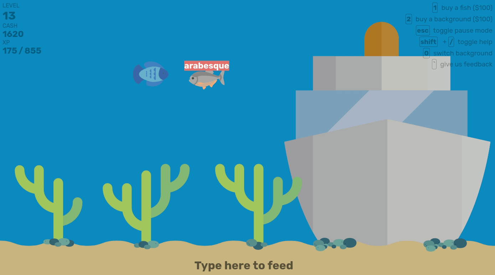

# typing-aquarium

## Overview
Typing Aquarium is a petting simulation game by using keyboard. By typing, you can feed the fish and get XP and cash points that you can use for buying more fish and exclusive aquarium backgrounds.

## Core feature(s)
- Typing while raising the fish using keyboard
- Buy fish and exclusive background
- Switch background
- Toggle helper

## Languages feature(s)
- TypeScript

## Snapshot

## Give feedback
Feedbacks are open to improve Typing Aquarium better by <a href="https://forms.gle/U7JF7tA9QbrA5Mjy6" target="_blank">clicking this</a>.